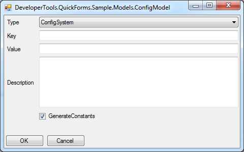

# Simple Model Based Windows Forms Generator at Runtime

## From this model

    public enum ConfigModelType { ConfigSystem, ConfigWorker, ConfigNotification, ConfigDisplay }

    public class ConfigModel
    {
        public ConfigModelType Type { get; set; }
        public String Key { get; set; }
        public String Value { get; set; }
        [EditorAttribute(EditorType = EditorFeatureType.MultiLine)]
        public String Description { get; set; }
        public bool GenerateConstants { get; set; }
    }

## Generate this form

## And not difficult to use

    var configModel = new ConfigModel();
    configModel.GenerateConstants = true;

    if (EditorForm<ConfigModel>.ShowDialog(configModel))
    {
        //TODO: do some action here
    }
    else
    {
        // canceled, nothing to do
    }

## More
<http://robb83.github.io>